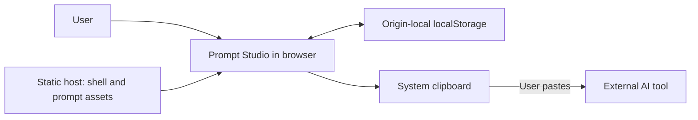
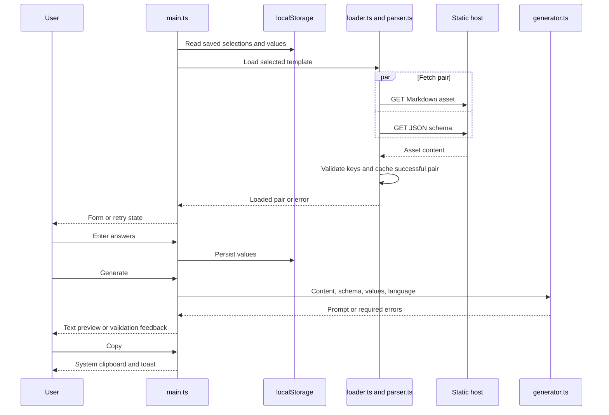

# Architecture and technical design

Status: **VERIFIED current state**; inferred rationale is identified separately. Last verified: **2026-10-05**.

## Observed architecture

The application is a static, client-only SPA using vanilla TypeScript and direct DOM APIs. Vite compiles the shell; the catalog is bundled; `public/prompts/` assets are copied into the build and fetched on demand. There are no client routes, server services, controllers, repositories, authentication services, workers, or AI-provider clients.



The AI tool is outside the application's runtime boundary. All expense optimization, topic-specific question selection, research synthesis, and relationship interpretation are instructions in prompt assets, not executable application algorithms.

## Modules and contracts

| Module | Responsibility / important contract |
| --- | --- |
| `index.html` | Mount point, metadata, and ES module entry. |
| `src/main.ts` | Mutable `AppState`, shell markup, render functions, event delegation, persistence, clipboard, shortcuts. |
| `src/data/catalog.ts` | `Category[]`; display metadata, tags, unique IDs, root-absolute asset URLs. |
| `src/types/index.ts` | `Category`, `Template`, `Placeholder`, `PlaceholderSchema`, `UserInput`, `LoadedTemplate`, `StoredState`, generation/error types. |
| `src/utils/parser.ts` | Extract distinct tokens and compare schema/token key sets. |
| `src/utils/loader.ts` | Concurrent asset fetch, response/JSON/key checks, page-session cache. |
| `src/utils/generator.ts` | Required-field validation, replacement, optional-line removal, cleanup, language suffix. |
| `src/style.css` | Bundled responsive controls/layout, light/dark color variables, system typography, and reduced-motion styles. |
| `public/prompts/` | Trusted prompt wording and adjacent field schemas; inventory in [overview](01-overview.md#current-catalog). |

`Template` has `id`, `title`, `description`, `tags`, `templatePath`, and `schemaPath`. `Category` includes legacy visual metadata and a template array; navigation currently uses its title. `LoadedTemplate` is `{ content, schema }`. `UserInput` maps placeholder keys to strings. A `Placeholder` requires `required: boolean`, `label: string`, and `type: 'text' | 'textarea'`; optional `description` and `placeholder` supply help/hints. Required fields appear first, with optional fields under a disclosure; JSON property order is preserved within each group. Runtime JSON is cast to these contracts rather than structurally validated.

The direct development dependencies are TypeScript **5.9.2** and Vite **7.1.5** in the lockfile. npm lockfile v3 pins transitive/platform packages. There is no UI framework or production npm runtime dependency.

## Template and generation semantics

Asset paths follow `/prompts/<category>/<id>.md` and `.json`. Registration is explicit; directory scanning is absent. Markdown is treated as plain text rather than parsed/rendered markup.

`parsePlaceholders()` recognizes:

```regex
\{\{\s*([a-zA-Z][\w-]*)\s*\}\}
```

Keys start with an ASCII letter; subsequent word characters/hyphens and internal whitespace are accepted. Duplicate occurrences become one key in first-seen order. Reserved `language` is excluded from normal schema matching. `validateSchema()` rejects missing schema entries and unused schema entries; it does not check field metadata types.

`loadTemplate()` caches successful pairs by template ID. On a miss, it fetches both URLs using `Promise.all`, rejects non-2xx responses, reads Markdown/JSON, validates key parity, and caches the pair. There is no timeout, cancellation, automatic retry, in-flight deduplication, persistent cache, or cache invalidation; retry is user-triggered.

`generatePrompt()` runs synchronously:

1. Reject missing/whitespace-only required values with label-based errors.
2. Normalize template CRLF to LF.
3. Process fields in schema order. Trim each supplied value; an empty optional value removes the entire line containing its token, then remaining occurrences are replaced globally.
4. Replace reserved `{{language}}` if present.
5. Remove trailing horizontal whitespace, collapse runs of three or more newlines, and trim the result.
6. Append a blank line and `Speak to me in <language>.`.

Replacement is textual, using JavaScript's string replacement semantics. It does not parse meaning, sanitize an AI instruction, validate numeric ledgers, or render Markdown. Templates normally omit the reserved language token to avoid redundant language wording. Authors must isolate optional tokens on lines that can disappear in full.

## Domain instructions in the new assets

| Asset | Instruction contract; downstream execution only |
| --- | --- |
| `general/split-expenses.md` | Equal shares by default, zero contributors included, integer payable units, largest-remainder share allocation, prior transfers separate, residual balances verified. Exact zero-sum partition search establishes unrestricted minimum `m - k`; incomplete search must say NOT PROVEN. Restrictions require separate constrained verification. |
| `general/idea-discovery.md`, `academic/research-idea.md` | Topic is the first required field. Initial response asks relevant questions and waits; follow-ups adapt to answers, normally at most two rounds of up to three questions, followed by practical ideas. |
| `psychology/personality-relationship.md` | Four initial form answers; downstream follow-ups adapt to context, with evidence-based observations, practical steps, and explicitly provisional readiness/fit. No diagnosis or fabricated compatibility score. |
| `academic/study-plan.md`, `academic/literature-review.md`, `psychology/personal-boundaries.md` | Respectively time-bounded learning, source-grounded review/planning, and realistic boundaries; missing information questions stay relevant to the supplied context. |

These safeguards are wording, not enforced model behavior. No new conversational state machine or optimization engine was added.

## State, persistence, and concurrency

One module-scoped `AppState` contains category/template, loaded pair, per-template inputs, errors, language/theme, output, search query, loading flag, and load error. Explicit region renderers update categories, templates, form, preview, and theme. Form input events update values, clear any generated output, and synchronously persist the complete stored payload without debouncing.

Persistence is browser `localStorage`, key **`prompt-studio-state-v1`**:

```ts
{
  categoryId: string;
  templateId: string;
  language: string;
  theme: 'light' | 'dark';
  inputs: Record<string, Record<string, string>>;
}
```

No database tables, keys/indexes, queries, transactions, migrations, seeds, or recovery system exist: **Database design: NOT APPLICABLE**. The browser payload is the only durable application data. There is no cross-tab synchronization listener or cross-device synchronization.

Read failures/corrupt JSON fall back to `{}`. Catalog IDs and language resolve to supported values, but stored object shape and theme are not fully validated. Writes lack quota/security-error handling. Output, errors, query, loaded assets, and loading state remain transient.

| Event | Output | Inputs | Search / errors |
| --- | --- | --- | --- |
| Select template | Cleared | Preserved per ID | Query preserved; errors cleared |
| Select category | Cleared | Preserved | Query/errors cleared; first template selected |
| Change language | Cleared | Preserved | Query/errors preserved |
| Edit input | Cleared; Copy disabled | Active field updated | That field's error cleared when nonblank |
| Reset | Cleared | Active template cleared | Query preserved; errors cleared |
| Reload | Empty | Restored | Query/errors not restored |

Fetching is asynchronous, UI generation/storage writes are synchronous, and toast removal uses a timer. No background jobs, queues, scheduled processing, app event bus, or worker concurrency exists: **NOT APPLICABLE**. A monotonically increasing request ID prevents older template loads or errors from replacing the latest selection; requests are not aborted.

## Error handling and observability

Asset HTTP/JSON/parity errors render a visible message and retry button. Required errors re-render fields, focus the first invalid field, and show a toast. Clipboard rejection tries a hidden textarea with `document.execCommand('copy')`, then reports the result. There is no centralized exception boundary, structured logger, telemetry, automatic retry, or metrics.

## Security

- Authentication, authorization, roles, sessions, tokens, secrets, server-side CSRF protections, and application rate limiting: **NOT APPLICABLE**; there is no restricted/server API surface.
- User values go into DOM `.value` and preview `.textContent`. Catalog/schema labels and load-error details are rendered through text APIs; `innerHTML` is used for fixed application markup and icons.
- Validation enforces required presence and token parity only. Stored state and field shape are not runtime-validated; prompt content does not receive instruction-injection filtering.
- Inputs may include code, financial details, research excerpts, or relationship reflections. Stored values are clear-text origin-local data, readable by same-origin scripts; app-level encryption at rest is absent. Output is copied only through the user-triggered copy handler.
- Runtime CSS is bundled and fonts come from the system; no third-party styling scripts or font requests are used. Transport encryption, CSP, HSTS, framing/MIME/referrer headers, static-host rate limits, and actual CORS policy are host responsibilities and **UNKNOWN**.
- The repository sends no form values to a backend. Ordinary asset requests still expose web-request metadata to the host. This is not a guarantee against a compromised same-origin script.
- Dependency locking exists; current vulnerability status is **NOT VERIFIED** in this update. Earlier documents mentioned a dated audit; no continuous security scan or CI is configured.

Risk ownership and unimplemented improvements are consolidated in [decisions](05-decisions.md#known-risks).

## APIs and integrations

**Application API design / OpenAPI: NOT APPLICABLE.** Fetch calls retrieve static files; there are no application endpoints, request bodies, API credentials, versioning, pagination, idempotency rules, or server validation contracts.

| Integration | Protocol / data / configuration | Failure and operating limits |
| --- | --- | --- |
| Same-origin prompt assets | Unauthenticated GET of Markdown/JSON; paths from catalog; no form values sent | Non-2xx/parse/parity errors → retry state; host caching/rate limits unknown |
| System clipboard | Browser `navigator.clipboard.writeText(output)`; legacy fallback; browser-controlled permission/context | Manual selection if copying fails; no remote service/auth/configuration |

No AI, payment, identity, analytics, email, storage-service, or research-database integration exists.

## Runtime and deployment boundaries

The browser loads the static shell, JavaScript/CSS bundles, restored state, and selected pair. A static host serves the Vite artifact at origin root; deploy procedure/configuration belongs in [development](04-development.md#deployment-and-operations).



Static hosting can scale asset delivery without shared server compute, but no CDN deployment or load testing is configured. Uncached templates need network access to the host. Origin-root paths, globally unique cache IDs, and browser API availability are architectural constraints. **INFERRED:** Content/schema separation fits repeatable local transformation; historical decision reasoning remains unknown and is handled in [ADR entries](05-decisions.md#architecture-decisions).
